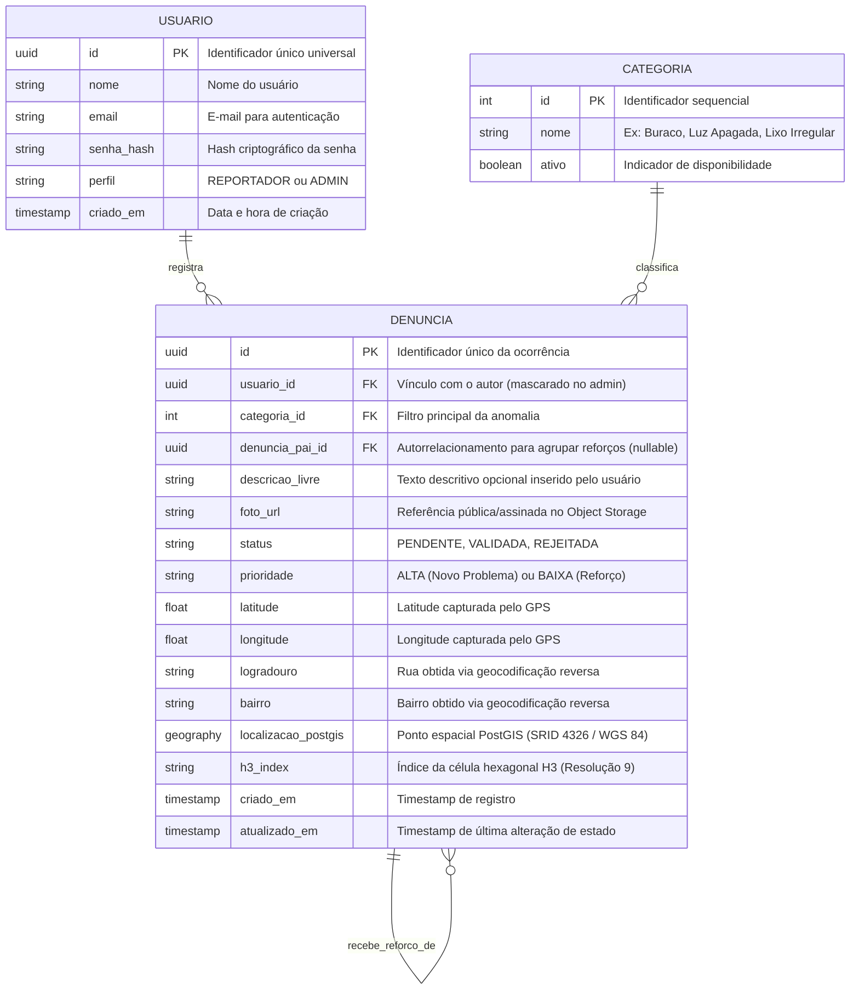
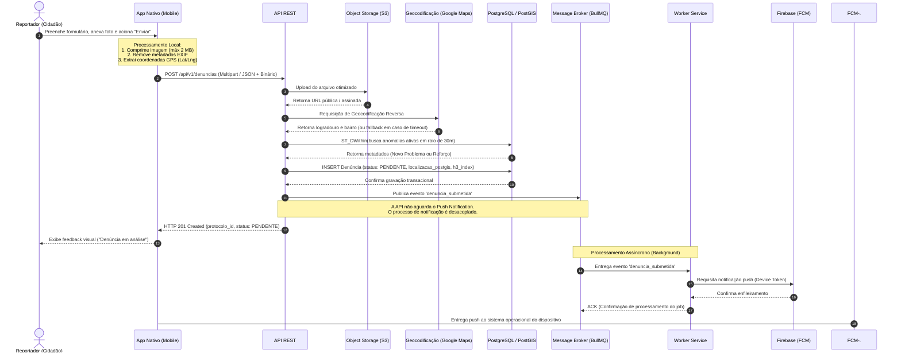

# Arquitetura do Sistema e Modelagem de Dados

Este documento consolida a especificação técnica e arquitetural da plataforma **AjudaMogi**, com base no Relatório Técnico-Científico do Trabalho de Graduação (*Aplicação Baseada em Geolocalização e Mapas de Calor para Zeladoria Urbana*, FATEC Mogi das Cruzes, 2026).

---

## 1. Visão Geral da Arquitetura

O **AjudaMogi** é uma solução distribuída voltada à descentralização e otimização da zeladoria urbana, integrando cidadãos, agentes de limpeza e a administração municipal. A arquitetura foi concebida para atender aos requisitos de alta escalabilidade nas consultas geoespaciais, tolerância a falhas em redes móveis e conformidade estrita com a Lei Geral de Proteção de Dados Pessoais (LGPD).

A solução está estruturada em quatro camadas principais:
1. **Atores do Sistema:** Reportadores (cidadãos e agentes de limpeza em campo) e Agentes Administrativos (equipe de triagem e zeladoria).
2. **Dispositivos Clientes:** Aplicativos móveis nativos (Android/Kotlin e iOS/Swift) e Painel Administrativo Web.
3. **Infraestrutura em Nuvem:** API RESTful principal, camada de cache em memória (Redis), banco de dados relacional e geoespacial (PostgreSQL + PostGIS), intermediário de mensageria assíncrona (BullMQ) e serviço consumidor em segundo plano (*worker*).
4. **Serviços de Terceiros:** Armazenamento de objetos (*object storage* AWS S3 / MinIO), serviço de geocodificação reversa (Google Maps / Mapbox) e mensageria push (Firebase Cloud Messaging - FCM).

```mermaid
graph TD
    subgraph Atores["Atores do Sistema"]
        User["Reportador (Cidadão / Agente de Limpeza)"]
        Admin["Agente Administrativo (Equipe de Zeladoria)"]
    end

    subgraph Clientes["Dispositivos Clientes"]
        App["App Móvel Nativo (Swift / Kotlin)<br/>• Compressão de mídia local<br/>• EXIF stripping<br/>• Cache offline (Room / Core Data)"]
        Web["Painel Administrativo Web<br/>• Fila de triagem<br/>• Payload masking"]
    end

    subgraph Nuvem["Infraestrutura em Nuvem"]
        API["API REST Principal (Node.js / Python)<br/>• Deduplicação espacial (ST_DWithin)<br/>• Rate Limiting estrito<br/>• Circuit Breaker"]
        Cache[("Camada de Cache<br/>Redis (TTL 5-15 min)")]
        DB[("Banco de Dados Relacional<br/>PostgreSQL + PostGIS")]
        Broker["Message Broker<br/>BullMQ"]
        Worker["Worker Service<br/>(Processamento Assíncrono)"]
    end

    subgraph ServicosExternos["Serviços de Terceiros"]
        S3["Armazenamento de Objetos<br/>AWS S3 / MinIO"]
        Geo["API de Geocodificação<br/>Google Maps / Mapbox"]
        FCM["Mensageria Push<br/>Firebase Cloud Messaging"]
    end

    %% Relações dos Atores
    User -->|Captura problema| App
    Admin -->|Realiza triagem| Web

    %% Relações dos Clientes com a API
    App -->|Envia denúncia (HTTPS)| API
    Web -->|Lê / Atualiza dados (HTTPS)| API

    %% Relações da API
    API -->|Upload de fotografia otimizada| S3
    API -->|Resolve coordenadas (Lat/Long)| Geo
    API -->|Deduplicação e persistência| DB
    API -->|Lê / Grava mapa de calor| Cache
    API -->|Publica evento 'denuncia_submetida'| Broker

    %% Relações de Assincronismo e Worker
    Broker -->|Consome evento| Worker
    Worker -->|Requisita disparo| FCM
    FCM -.->|Notificação push no dispositivo| App
```

---

## 2. Tecnologias Utilizadas e Justificativas Técnicas

| Componente | Tecnologia Prevista | Finalidade e Justificativa Técnica |
| :--- | :--- | :--- |
| **Aplicativo Android** | Kotlin (Desenvolvimento Nativo) | Interface do Reportador com acesso de baixo nível e otimizado ao hardware (câmera, receptor GPS) e gerenciamento de energia. |
| **Aplicativo iOS** | Swift (Desenvolvimento Nativo) | Interface do Reportador para o ecossistema Apple com desempenho nativo e integração ao subsistema de sensores. |
| **Persistência Local (Mobile)** | SQLite (Room no Android / Core Data no iOS) | Gerenciamento da fila de submissão local (*offline-first*), garantindo a retenção da denúncia até o restabelecimento da conectividade. |
| **Tarefas em Segundo Plano** | WorkManager (Android) / BackgroundTasks (iOS) | Sincronização resiliente em background das ocorrências retidas quando o dispositivo recupera acesso à rede. |
| **Painel Administrativo** | Aplicação Web SPA (Navegador) | Interface segura para auditoria, triagem de ocorrências, visualização de evidências e validação humana. |
| **API REST Principal** | Node.js ou Python (a definir) | Orquestração das regras de negócio, cálculo de deduplicação espacial, controle de concorrência e endpoints públicos/administrativos. |
| **Banco de Dados Relacional** | PostgreSQL + extensão PostGIS | Armazenamento de entidades e execução de consultas espaciais de alta performance utilizando o tipo nativo `geography` e funções indexadas como `ST_DWithin`. |
| **Indexação Espacial** | Uber H3 (Resolução 9) | Sistema de grade hexagonal global e hierárquico. Agrupa coordenadas (*hexbinning*) para renderizar mapas de calor compactos e padronizados. |
| **Camada de Cache** | Redis | Cache em memória (*Cache-Aside*) para absorver o alto tráfego de leitura assimétrica do mapa de calor público, aliviando o banco relacional. |
| **Intermediário de Mensageria** | BullMQ | *Message Broker* baseado em Redis para desacoplamento de operações síncronas de longa duração (disparo de notificações, reprocessamentos). |
| **Armazenamento de Objetos** | AWS S3 ou MinIO | Armazenamento seguro e escalável de evidências fotográficas, persistindo apenas a URL pública ou assinada no banco de dados. |
| **Geocodificação Reversa** | Google Maps API ou Mapbox | Conversão de coordenadas (latitude/longitude) em endereço legível (logradouro e bairro). |
| **Notificações Push** | Firebase Cloud Messaging (FCM) | Entrega confiável de alertas de transição de status para os dispositivos dos munícipes. |
| **Segurança e Criptografia** | HTTPS/TLS 1.3 e JWT (Bearer Token) | Criptografia em trânsito de todos os payloads e autenticação compacta baseada em tokens. |

---

## 3. Modelo de Dados (DER)

O banco de dados relacional foi modelado em conformidade com as restrições de privacidade da LGPD e os requisitos de deduplicação espacial. As ocorrências são desacopladas de registros civis diretos e utilizam chaves artificiais do tipo UUID.

### 3.1. Diagrama Entidade-Relacionamento



### 3.2. Autorrelacionamento e Deduplicação (`denuncia_pai_id`)
O atributo `denuncia_pai_id` implementa o autorrelacionamento `recebe_reforco_de`:
- **Denúncia Pai (Novo Problema):** Possui `denuncia_pai_id = NULL` e `prioridade = 'ALTA'`. Funciona como a âncora geográfica da anomalia na fila de triagem.
- **Denúncia Filha (Reforço):** Possui `denuncia_pai_id` apontando para o UUID da denúncia ativa primária e `prioridade = 'BAIXA'`. Ela não gera novo ícone individual no mapa público, mas agrega evidências e soma peso ao hexágono de calor correspondente.

---

## 4. Fluxo de Submissão de Denúncia (Diagrama de Sequência)

A submissão de uma denúncia é executada de forma assíncrona e desacoplada para garantir que o tempo de resposta à requisição do usuário seja inferior a 2 segundos (RNF05), mesmo que serviços de notificação externa possuam latência elevada.



### Detalhamento das 20 Etapas do Fluxo:
1. O munícipe preenche os dados da denúncia e tira a foto no aplicativo.
2. O aplicativo nativo executa a compressão da imagem (limitada a 2 MB) e expurga os metadados sensíveis de EXIF (*EXIF stripping*).
3. O aplicativo consulta a posição do dispositivo via serviços nativos de localização (GPS).
4. O aplicativo despacha a requisição HTTP `POST /api/v1/denuncias`.
5. A API REST envia o arquivo binário comprimido ao bucket de armazenamento de objetos (S3 ou MinIO).
6. O serviço de armazenamento confirma o upload e retorna a URL permanente/assinada.
7. A API requisita à API de mapas a resolução das coordenadas em endereço urbano legível.
8. A API de geocodificação retorna os nomes do logradouro e do bairro.
9. A API consulta o PostGIS executando a função indexada `ST_DWithin` num raio de 30 metros para registros ativos da mesma categoria.
10. O PostGIS retorna se existe ocorrência correspondente; caso exista, a denúncia é rotulada como **Reforço** (vinculada à pai); caso contrário, como **Novo Problema**.
11. A API executa a inserção dos dados na tabela `DENUNCIA` com status inicial obrigatório `PENDENTE`, gerando o índice H3 (resolução 9) e o ponto PostGIS.
12. O banco de dados confirma o encerramento da transação (*commit*).
13. A API despacha o evento assíncrono `denuncia_submetida` para o intermediário de mensagens (BullMQ).
14. A API responde imediatamente com o código `HTTP 201 Created` e o protocolo gerado ao aplicativo.
15. O aplicativo atualiza a tela do usuário informando que a denúncia foi protocolada com sucesso e está em análise.
16. O message broker entrega o payload do evento a um *worker process* disponível.
17. O *worker* formata a mensagem e requisita o disparo ao gateway do Firebase Cloud Messaging (FCM).
18. O Firebase confirma o recebimento e o agendamento da entrega da notificação.
19. O *worker* envia o sinal de confirmação (*acknowledgement* - ACK) para a fila do broker.
20. O Firebase entrega o alerta push ao dispositivo do munícipe.

---

## 5. Estratégias Transversais de Arquitetura

### 5.1. Cache e Escalabilidade do Mapa de Calor (Redis)
* **Padrão Utilizado:** *Cache-Aside* (Lazy Loading).
* **Leitura Assimétrica:** O mapa público é consumido centenas de milhares de vezes por dia, enquanto a submissão e a validação de denúncias ocorrem com menor frequência. Consultar o PostGIS e recalcular as agregações hexagonais a cada acesso geraria sobrecarga crítica no banco relacional.
* **TTL (Time To Live):** Configuração de expiração automática entre **5 e 15 minutos**. Garante dados em tempo quase real (*near real-time*) com redução estimada de carga de leitura superior a 90%.
* **Invalidação Reativa:** Sempre que uma denúncia transitar de estado para `VALIDADA` ou `RESOLVIDA` pela triagem administrativa, um evento assíncrono invalida a chave de cache correspondente no Redis, assegurando atualização tempestiva.

### 5.2. Resiliência e Comportamento Offline-First
* **Fila Local Persistente:** Caso o munícipe esteja em área de sombra de rede móvel (ou sem pacote de dados), o aplicativo armazena a ocorrência (dados e imagem comprimida) no banco SQLite local (Room no Android / Core Data no iOS), marcando-a como `Aguardando Sincronização`.
* **Sincronização Silenciosa em Background:** Serviços nativos de segundo plano (`WorkManager` no Android e `BackgroundTasks` no iOS) monitoram a conectividade do aparelho. Ao restabelecer a conexão (ex: transição para Wi-Fi ou rede estável), as denúncias retidas são enviadas automaticamente sem demandar nova intervenção do usuário.
* **Circuit Breaker para Integrações Externas:** Na API REST, as chamadas para serviços externos de terceiros (como geocodificação da Google) são encapsuladas sob o padrão *Circuit Breaker*. Se o provedor externo apresentar falha ou latência extrema, o disjuntor abre: a denúncia é salva com logradouro em branco e uma tarefa de background é agendada para preenchimento posterior, impedindo que falhas de terceiros bloqueiem a criação da denúncia pelo cidadão.

### 5.3. Clusterização Hexagonal com Uber H3
* **Resolução 9:** O H3 divide a superfície terrestre em hexágonos discretos. Na resolução 9 adotada:
  * Área média por hexágono: **0,105 km²**;
  * Comprimento médio da aresta: **0,201 km** (~200 metros).
* **Vantagens Técnicas dos Hexágonos:** Todos os vizinhos compartilham a mesma distância de centro a centro (ao contrário de quadrículas cartesianas normais, que possuem vizinhos ortogonais e diagonais com distâncias distintas). Isso elimina distorções visuais e viabiliza gradientes térmicos suaves no mapa de calor.

---

## 6. Requisitos Não Funcionais (RNF)

| ID | Nome do Requisito | Especificação Técnica | Critério de Aceite / Métrica |
| :--- | :--- | :--- | :--- |
| **RNF01** | Arquitetura Nativa | Desenvolvimento nativo em Swift (iOS) e Kotlin (Android). | Acesso direto ao hardware de câmera e localização via SDKs oficiais, sem intermediadores webview. |
| **RNF02** | Compressão de Mídia (*Client-Side*) | Compressão prévia da imagem no smartphone antes do despacho HTTP. | Payload máximo da imagem não pode ultrapassar **2 MB**. |
| **RNF03** | Arquitetura Geoespacial | Utilização do PostgreSQL acoplado à extensão PostGIS com SRID 4326. | Uso obrigatório do tipo `geography` e de índices espaciais GIST em consultas por raio (`ST_DWithin`). |
| **RNF04** | Clusterização de Mapa (H3) | Agregação espacial baseada na biblioteca de indexação hexagonal hierárquica Uber H3. | Retorno na API do índice hexagonal (`h3_index`) e seu respectivo peso/gravidade agregado. |
| **RNF05** | Desempenho de Submissão | Processamento síncrono da lógica de deduplicação e retorno do protocolo. | Resposta da criação de denúncia (`HTTP 201`) em **tempo inferior a 2 segundos** em condições normais de rede. |
| **RNF06** | Armazenamento em Nuvem | Persistência de arquivos binários em *Object Storage* (AWS S3 ou MinIO). | Apenas a URL do recurso deve ser salva no banco relacional, mantendo o banco leve. |
| **RNF07** | Segurança e Criptografia | Toda a comunicação entre clientes, painel e servidor deve trafegar sob HTTPS/TLS 1.3. | Autenticação via JSON Web Token (JWT) e expurgo de credenciais ou chaves sensíveis em logs. |
