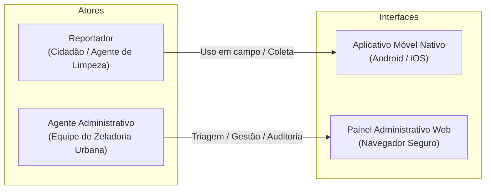
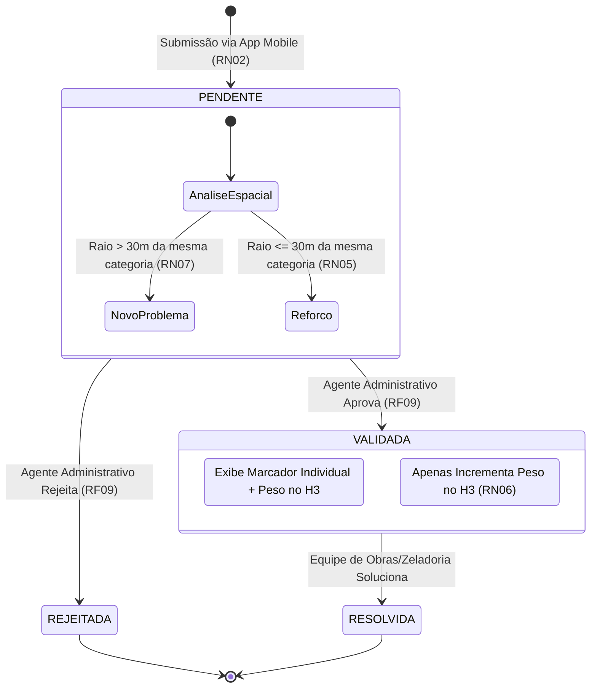
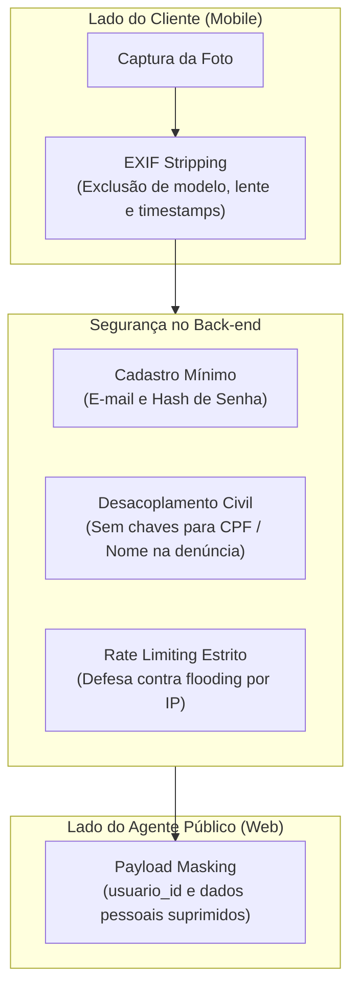

# Regras de Negócio, Atores e Ciclo de Vida

Este documento detalha os perfis de usuários, requisitos funcionais, regras de negócio normativas, a máquina de estados das ocorrências e as diretrizes de privacidade e conformidade com a LGPD da plataforma **AjudaMogi**, em conformidade com o Relatório Técnico-Científico do Trabalho de Graduação (FATEC Mogi das Cruzes, 2026).

---

## 1. Atores do Sistema

Para delimitar o Produto Mínimo Viável (MVP) e assegurar foco técnico e operacional, o sistema estabelece dois perfis primários de interação:

### 1.1. Reportador (Cidadãos e Agentes de Limpeza em Campo)
* **Ambiente de Acesso:** Exclusivamente via aplicativos móveis nativos (Android e iOS).
* **Atribuições:**
  * Coleta primária de anomalias urbanas com registro fotográfico em tempo real e captura de coordenadas GPS;
  * Seleção da categoria do problema (ex: buraco, lixo irregular, falha de iluminação);
  * Acompanhamento do histórico de suas próprias denúncias submetidas;
  * Visualização pública de ocorrências validadas e do mapa de calor da cidade;
  * Recebimento de notificações push sobre mudanças de status de suas manifestações.

### 1.2. Agente Administrativo (Equipe de Zeladoria Urbana)
* **Ambiente de Acesso:** Painel administrativo web acessado via navegador sob autenticação segura.
* **Atribuições:**
  * Consumo da fila de triagem assíncrona ordenada por nível de prioridade (urgência ou reforço);
  * Auditoria humana das imagens submetidas para verificação de legitimidade;
  * Gestão de estados das ocorrências: validar, rejeitar ou recategorizar anomalias;
  * Operação sob mascaramento de dados (*payload masking*), sem acesso à identidade civil do munícipe.

---

## 2. Requisitos Funcionais (RF)

| ID | Nome do Requisito | Descrição Operacional |
| :--- | :--- | :--- |
| **RF01** | Autenticação de Usuário | O aplicativo móvel deve permitir que cidadãos e agentes de limpeza criem contas e realizem login, associando as denúncias a um perfil técnico rastreável via JWT. |
| **RF02** | Submissão de Denúncia | O aplicativo móvel deve permitir o registro de um problema urbano, exigindo categoria, captura de fotografia em tempo real e coleta automática das coordenadas de GPS do aparelho. |
| **RF03** | Visualização de Mapa Interativo | O aplicativo deve disponibilizar interface de mapa interativo com marcadores (ícones) para as ocorrências individuais com status `VALIDADA`. |
| **RF04** | Visualização de Mapa de Calor | O aplicativo deve renderizar camada de calor agregada (*hexbinning* via H3) sobreposta ao mapa, variando a cor conforme volume e gravidade das anomalias validadas. |
| **RF05** | Histórico do Usuário | O aplicativo móvel deve exibir o histórico de denúncias submetidas exclusivamente pelo usuário autenticado, com o status atualizado de cada uma. |
| **RF06** | Notificações Push | O sistema deve disparar notificação push ao dispositivo do usuário sempre que houver transição de status em sua denúncia (ex: `PENDENTE` -> `VALIDADA`). |
| **RF07** | Autenticação Administrativa | O painel web administrativo deve possuir controle de acesso restrito e autenticado exclusivamente para operadores e gestores municipais. |
| **RF08** | Fila de Triagem | O painel web deve listar as denúncias pendentes em formato de fila de atendimento, ordenadas por prioridade técnica (urgência/novo problema antes de reforço). |
| **RF09** | Gestão de Denúncias | O painel administrativo deve possibilitar ao agente validar, rejeitar ou corrigir a categoria de uma denúncia pendente, exibindo a fotografia e o ponto no mapa. |
| **RF10** | Rotulação Automática | O back-end deve identificar e rotular automaticamente denúncias como `Novo Problema` ou `Reforço` por meio de consulta espacial de proximidade geográfica. |

---

## 3. Regras de Negócio (RN)

As regras de negócio delimitam o comportamento do domínio, o fluxo de dados e os critérios de aceitação da plataforma:

| ID | Nome da Regra | Descrição Normativa |
| :--- | :--- | :--- |
| **RN01** | **Obrigatoriedade de Evidência** | É estritamente proibido o registro de qualquer denúncia sem anexo de fotografia capturada em tempo real ou validada por metadados de câmera. **Denúncias compostas exclusivamente por texto não são aceitas.** |
| **RN02** | **Estado Inicial Transitório** | Toda nova denúncia submetida no sistema deve ser gravada compulsoriamente com o status inicial **`PENDENTE`**. |
| **RN03** | **Isolamento de Dados Pendentes** | Denúncias com status **`PENDENTE`** ou **`REJEITADA`** são estritamente invisíveis na interface pública do mapa e **não devem compor o cálculo do mapa de calor sob hipótese alguma**. |
| **RN04** | **Visibilidade Condicional** | Apenas as ocorrências que atingirem o status **`VALIDADA`** (após triagem humana ou auditoria) passam a integrar a renderização de ícones no mapa público e o cômputo de peso das células hexagonais H3. |
| **RN05** | **Deduplicação Espacial (Reforço)** | Caso uma nova ocorrência seja registrada em um raio de até **30 metros** de uma denúncia já existente e ativa da mesma categoria, o sistema deverá rotulá-la como **`Reforço`**, associar seu `denuncia_pai_id` ao registro original e classificá-la com **prioridade baixa** na fila de triagem. |
| **RN06** | **Adensamento de Calor** | Uma denúncia validada classificada como **`Reforço`** não gerará um novo ícone/marcador de problema no mapa do usuário, mas incrementará o peso (intensidade térmica) do hexágono H3 correspondente no mapa de calor. |
| **RN07** | **Identificação de Anomalia (Novo Problema)** | Denúncias submetidas em coordenadas onde não há registros ativos da mesma categoria em um raio de **30 metros** devem ser rotuladas como **`Novo Problema`**, recebendo **prioridade alta (urgência)** na fila de triagem da zeladoria. |

---

## 4. Máquina de Estados e Ciclo de Vida da Denúncia

O ciclo de vida de uma ocorrência no AjudaMogi é regido por uma máquina de estados finita e determinística:

### 4.1. Detalhamento dos Estados
1. **`PENDENTE` (Estado Inicial):**
   * A denúncia foi gravada no banco relacional e aguarda verificação.
   * Invisível no mapa interativo público e desconsiderada no mapa de calor (RN03).
   * A rotulação automática (RF10) divide internamente as pendências em:
     * *Novo Problema:* Prioridade alta de triagem.
     * *Reforço:* Prioridade baixa de triagem (agrupada à denúncia-mãe).
2. **`VALIDADA` (Estado Ativo Público):**
   * O agente administrativo confirmou a veracidade da imagem e do problema.
   * Dispara invalidação reativa da chave de cache do mapa de calor no Redis.
   * Dispara notificação push (FCM) informando ao munícipe que o chamado foi aceito e encaminhado para manutenção (RF06).
   * Se for *Novo Problema*, plota novo marcador no mapa interativo (RF03) e soma peso na célula H3 (RF04).
   * Se for *Reforço*, não plota novo marcador, apenas incrementa a densidade no mapa de calor (RN06).
3. **`REJEITADA` (Estado Terminal Neutro):**
   * O agente identificou evidência fraudulenta, imagem ilegível, fora de escopo ou duplicidade inválida.
   * Não compõe mapas nem cálculos de calor (RN03).
   * Dispara notificação push ao munícipe comunicando a rejeição e o motivo da decisão.
4. **`RESOLVIDA` (Estado de Encerramento):**
   * O problema estrutural foi consertado pelas equipes operacionais em campo.
   * A denúncia deixa de ser uma anomalia ativa, liberando o raio de 30 metros para futuras ocorrências e atualizando o mapa de calor.

---

## 5. Diretrizes de Segurança, Privacidade e LGPD

A arquitetura do AjudaMogi foi concebida sob as doutrinas de **Privacy by Design** e **Minimização de Dados (*Data Minimization*)**, em estrita observância à Lei Geral de Proteção de Dados Pessoais (Lei nº 13.709/2018, art. 6º, III e art. 46):

### 5.1. Identidade e Anonimato Perante o Ente Público
* **Cadastro Técnico Mínimo:** A criação de contas pelo cidadão demanda unicamente e-mail e senha com hash seguro (bcrypt/argon2), visando apenas a emissão de tokens JWT e associação técnica de sessão.
* **Desacoplamento de Dados Civis:** A tabela de ocorrências (`DENUNCIA`) vincula-se ao titular estritamente por um identificador universal aleatório (`UUID`). Não existem chaves estrangeiras diretas para tabelas com CPF, endereço residencial ou dados civis do cidadão.
* **Mascaramento de Carga (*Payload Masking*):** Nas respostas da API REST consumidas pelo painel web dos agentes administrativos, os campos `usuario_id`, e-mail e quaisquer metadados de autoria da denúncia são **suprimidos**. O operador público visualiza estritamente a anomalia (foto, geolocalização, categoria e descrição do problema), impedindo perseguições políticas, represálias ou privilégios de atendimento.

### 5.2. Gestão de Histórico e Controle do Titular
* Embora anônima perante a administração pública, o sistema assegura ao munícipe a rastreabilidade integral de suas próprias denúncias (conforme os direitos do titular previstos na LGPD).
* O aplicativo consulta a rota `GET /api/v1/denuncias/minhas`, onde a API extrai o `UUID` contido nas declarações (*claims*) do Bearer Token JWT e recupera apenas as ocorrências daquele munícipe.

### 5.3. Isolamento de Metadados Críticos (*EXIF Stripping*)
* As fotos tiradas por smartphones contêm metadados sensíveis no padrão EXIF (Exchangeable Image File Format), que revelam fabricante, modelo do aparelho, configurações de lente, orientação, software do dispositivo e data/hora do chip de hardware.
* O aplicativo móvel realiza nativamente a **remoção total dos metadados EXIF** (*EXIF stripping*) no momento da compressão da mídia (RNF02), antes do envio ao *Object Storage*. Apenas os bytes essenciais da imagem comprimida (JPEG/HEIC) trafegam para a nuvem.

### 5.4. Proteção de Endpoints (Rate Limiting e Defesa Anti-Spam)
* A API REST aplica **Rate Limiting** estrito baseado em janelas deslizantes por endereço IP e por credencial autenticada.
* Essa blindagem mitiga ataques de negação de serviço distribuída (DDoS) e inviabiliza que agentes maliciosos executem *scripts* automatizados para inundar o mapa de calor com falsas ocorrências consecutivas (*ghost reports*).
